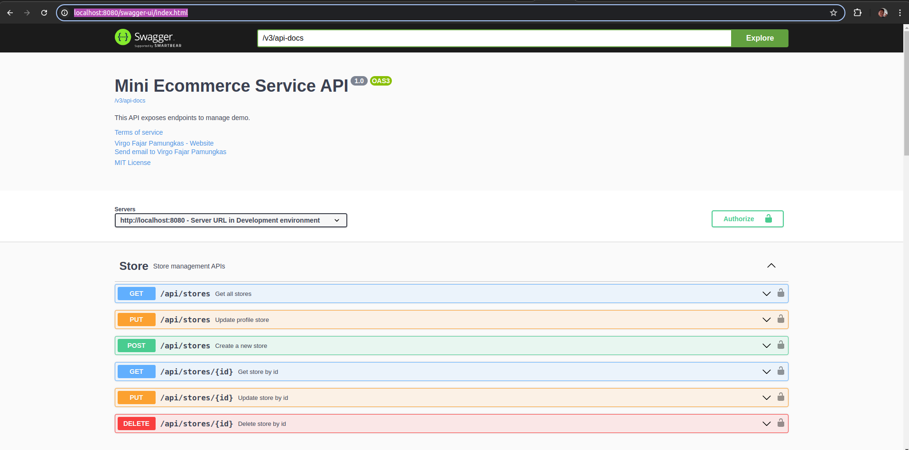

# Mini E-Commerce Project

Proyek ini adalah implementasi sederhana dari sistem e-commerce menggunakan Java 17 dan Maven. Proyek ini mencakup beberapa teknologi dan fitur seperti Spring IoC, Java Stream, Native SQL Query, Redis Caching, dan PostgreSQL. Dokumentasi API dapat diakses melalui Swagger atau melalui Postman Collection yang tersedia di dalam folder `resources`.

## Implementasi

- **Java 17**: Versi Java yang digunakan untuk proyek ini.
- **Maven**: Manajemen dependensi dan build.
- **Spring IoC**: Menggunakan Inversion of Control untuk pengelolaan bean dan dependensi.
- **Java Stream**: Penggunaan Java Stream API untuk memproses koleksi data.
- **Native SQL Query**: Menggunakan query SQL native untuk berinteraksi dengan database.
- **Redis Caching**: Implementasi caching menggunakan Redis untuk meningkatkan performa aplikasi.
- **PostgreSQL**: Basis data relasional yang digunakan untuk menyimpan data aplikasi.
- **Swagger**: Dokumentasi API interaktif yang bisa diakses di `http://localhost:8080/swagger-ui/index.html`.
  
- 

## Prasyarat

Sebelum menjalankan proyek ini, pastikan Anda telah menginstal:

- Java 17
- Maven
- PostgreSQL
- Redis

## Instalasi dan Konfigurasi

1. **Clone repository:**
   ```bash
   git clone <repository-url>
   cd mini-helmify
   ```
2. **Konfigurasi Database:**

Pastikan PostgreSQL berjalan dan buat database untuk aplikasi ini.
Update file src/main/resources/application.properties dengan detail koneksi PostgreSQL Anda.
properties
Copy code

```
spring.datasource.url=jdbc:postgresql://localhost:5432/nama_database
spring.datasource.username=nama_pengguna
spring.datasource.password=password
```

3. **Menjalankan Aplikasi:**

```bash Copy code
mvn spring-boot:run
```

4. **Akses Dokumentasi API:**

Buka browser dan akses http://localhost:8080/swagger-ui/index.html untuk melihat dokumentasi API.

5. **Testing API:**

Import Postman Collection JSON yang ada di folder resources untuk melakukan pengujian API.

## Struktur Proyek

```
src/main/java: Kode sumber utama aplikasi.
src/main/resources: Berkas konfigurasi dan resource lainnya, termasuk Postman Collection untuk testing.
pom.xml: Berkas konfigurasi Maven untuk mengelola dependensi dan build.
```

## Konfigurasi Redis

Instal dan jalankan Redis:

Unduh dan instal Redis dari situs resmi Redis.
Jalankan Redis server dengan perintah redis-server.

Konfigurasi aplikasi untuk Redis:

Update file src/main/resources/application.properties dengan detail konfigurasi Redis.

```properties Copy code
spring.redis.host=localhost
spring.redis.port=6379
```

## Fitur Tambahan

Caching dengan Redis: Menggunakan Redis untuk caching data, meningkatkan performa aplikasi dengan mengurangi waktu akses ke database.
SQL Native Queries: Menggunakan native SQL untuk operasi database yang lebih kompleks atau khusus.
